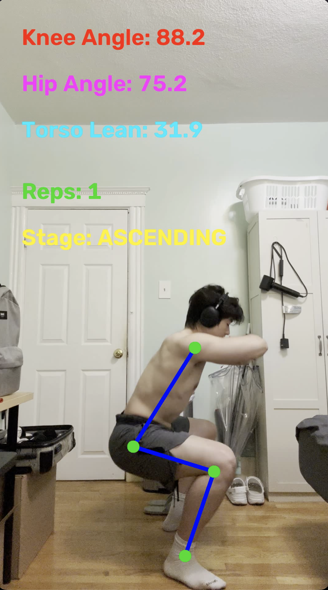
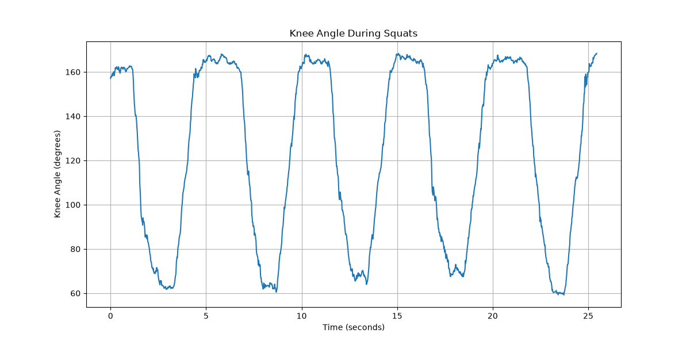

# AI Exercise Form Analyzer

A computer vision project for analyzing side-view squat performance from video.

The system uses MediaPipe Pose and OpenCV to detect body landmarks, track squat repetitions, measure joint angles, analyze movement tempo, and generate structured workout reports.

## Overview

The AI Exercise Form Analyzer processes a recorded squat video and extracts movement data from each repetition.

The current version focuses on side-view bodyweight squats. It automatically selects the more visible side of the body and tracks the shoulder, hip, knee, and ankle throughout the exercise.

The system can identify individual squat repetitions and generate both visual and numerical analysis.

## Features

- Automatic left/right body-side selection
- Human pose detection using MediaPipe
- Automatic squat repetition counting
- Knee angle measurement
- Hip angle measurement
- Torso lean measurement
- Squat movement stage detection
  - Standing
  - Descending
  - Bottom
  - Ascending
- Descent and ascent duration analysis
- Tempo ratio analysis
- Per-repetition statistics
- Set-level consistency analysis
- Landmark visibility validation
- Ankle position jump detection
- Annotated output video
- Knee-angle visualization
- JSON analysis report
- CSV repetition report

## Technologies

- Python
- OpenCV
- MediaPipe Pose Landmarker
- Matplotlib
- Python Statistics
- JSON
- CSV


## How It Works

The analysis pipeline follows these main steps:

1. Load the input exercise video.
2. Detect body landmarks using MediaPipe Pose.
3. Automatically select the more visible side of the body.
4. Track the shoulder, hip, knee, and ankle.
5. Calculate knee angle, hip angle, and torso lean for each valid frame.
6. Detect squat movement stages and completed repetitions.
7. Measure descent time, ascent time, and tempo ratio for each repetition.
8. Calculate consistency statistics across the full set.
9. Generate an annotated video, graph, JSON report, and CSV report.

> **Note:** The current version is designed primarily for side-view squat analysis.

## Demo

### Annotated Squat Analysis

The analyzer overlays pose landmarks and real-time movement metrics on the input video, including knee angle, hip angle, torso lean, repetition count, and movement stage.



### Knee Angle Tracking

Knee angle is recorded throughout the video to visualize the movement pattern of each squat repetition.



## Installation

### 1. Clone the repository

```bash
git clone https://github.com/Ahao-cmd/ai-exercise-form-analyzer.git
cd ai-exercise-form-analyzer
```

### 2. Create a virtual environment

```bash
python3 -m venv .venv
source .venv/bin/activate
```

### 3. Install the required Python packages

```bash
pip install -r requirements.txt
```

### 4. Add the MediaPipe Pose model

Place the MediaPipe Pose Landmarker model at:

```text
models/pose_landmarker_full.task
```

## Usage

Place a side-view squat video inside the `videos/` directory.

For example:

```text
videos/test_squat.mov
```

Run the analyzer:

```bash
python src/annotate_video.py --video videos/test_squat.mov
```

The program will automatically:

- Detect body landmarks
- Select the more visible left or right side
- Track squat repetitions
- Measure knee angle, hip angle, and torso lean
- Analyze descent and ascent timing
- Evaluate repetition consistency
- Detect low-visibility landmarks
- Flag suspicious ankle position changes
- Generate analysis files

## Output Files

Each analyzed video receives its own output directory.

Example:

```text
outputs/
└── test_squat/
    ├── squat_analysis.mp4
    ├── knee_angle_plot.png
    ├── analysis_report.json
    └── rep_analysis.csv
```

### `squat_analysis.mp4`

Annotated version of the original video showing:

- Tracked body landmarks
- Knee angle
- Hip angle
- Torso lean
- Repetition count
- Current movement stage

### `knee_angle_plot.png`

Visualization of knee angle changes throughout the workout.

### `analysis_report.json`

Structured analysis containing:

- Total repetitions
- Set-level averages
- Consistency measurements
- Per-repetition statistics
- Tempo information

### `rep_analysis.csv`

Tabular per-repetition data that can be opened in Excel, Numbers, or other spreadsheet software.

## Evaluation Results

The current version was evaluated on multiple side-view squat videos recorded under different viewing conditions.

| Test Video | View | Result | Tracking Diagnostics |
|---|---|---|---|
| Baseline Test | Left side | 5 / 5 repetitions detected | 0 low-visibility frames, 0 suspicious ankle jumps |
| Clean Right-Side Test | Right side | 4 / 4 repetitions detected | 0 low-visibility frames, 0 suspicious ankle jumps |
| Partial-Occlusion Test | Right side | 3 repetitions confirmed | 2 low-visibility frames, 8 suspicious ankle jumps |

The clean left and right-side tests were used to verify repetition counting and automatic body-side selection.

The partial-occlusion test intentionally included poorer ankle visibility. The analyzer detected both low-visibility frames and abnormal ankle-position changes. To avoid counting incomplete movements after tracking loss, the repetition tracker uses a conservative recovery strategy that requires the athlete to return to a confirmed standing position before starting a new repetition.

These results are preliminary and are based on a small test set. The current thresholds are experimental and are not intended to represent clinically validated movement standards.

## Known Limitations

The current version has several limitations:

- The analyzer is designed primarily for side-view bodyweight squats.
- Pose accuracy can decrease when important joints are partially occluded.
- Camera angle, camera distance, and video quality may affect measured joint angles.
- The current repetition-counting and tracking thresholds were selected experimentally using a small set of test videos.
- Ankle jump detection currently focuses on detecting suspicious ankle movement rather than validating every body landmark.
- Tracking loss may cause an incomplete repetition to be discarded.
- Measurements from different videos should not be treated as directly comparable without consistent camera positioning.
- The system provides descriptive movement metrics and does not provide medical, injury-prevention, or clinically validated form assessments.

## Future Improvements

Future development could include:

- Evaluate the analyzer on a larger and more diverse set of squat videos.
- Improve landmark stability detection for the knee, hip, shoulder, and ankle.
- Add short-term tracking recovery for brief landmark occlusions.
- Improve automatic body-side selection using multiple frames instead of a single initial pose.
- Add support for additional exercises such as deadlifts and lunges.
- Refactor the current analysis pipeline into separate pose detection, repetition tracking, metrics, and reporting modules.
- Add configurable analysis thresholds.
- Develop a more user-friendly interface for uploading videos and viewing results.
